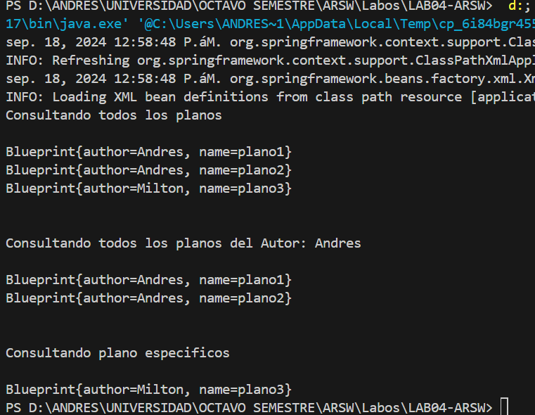
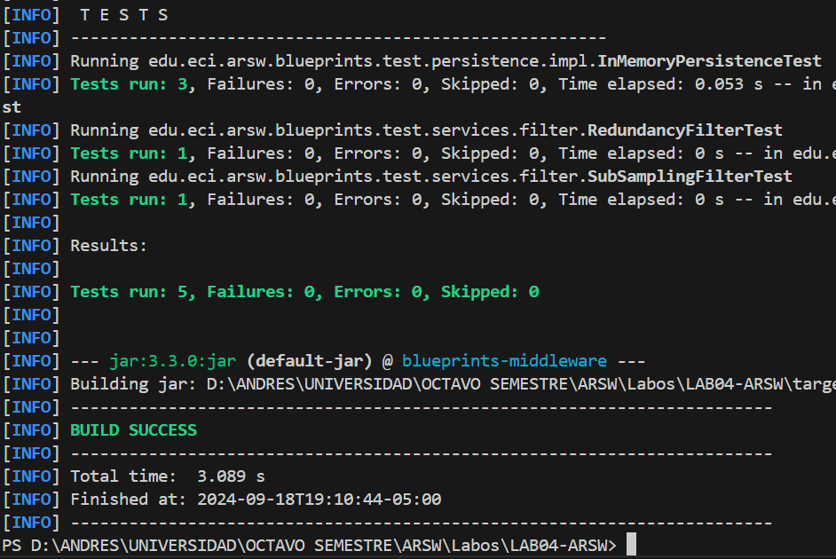

## Escuela Colombiana de Ingeniería

## Arquitecturas de Software

# Componentes y conectores - Parte I.

El ejercicio se debe traer terminado para el siguiente laboratorio (Parte II).

#### Middleware- gestión de planos.


## Antes de hacer este ejercicio, realice [el ejercicio introductorio al manejo de Spring y la configuración basada en anotaciones](https://github.com/ARSW-ECI/Spring_LightweightCont_Annotation-DI_Example).

link de repo: [link repositorio con el desarrollo](https://github.com/MiltonGutierrez/LAB04.1-ARSW).


En este ejercicio se va a construír un modelo de clases para la capa lógica de una aplicación que permita gestionar planos arquitectónicos de una prestigiosa compañia de diseño. 


1. Configure la aplicación para que funcione bajo un esquema de inyección de dependencias, tal como se muestra en el diagrama anterior.


	Lo anterior requiere:

	* Agregar las dependencias de Spring.
		Las dependencias de Spring ya están registradas en el Pom.
	* Agregar la configuración de Spring.
		La configuracion de Spring para soluciobar este punto ya estaba hecha.
	* Configurar la aplicación -mediante anotaciones- para que el esquema de persistencia sea inyectado al momento de ser creado el bean 'BlueprintServices'.
		Para poder hacer esto, se mantiene la anotacion de @Service a la *BluePrintsServices*, adicionalmente se utiliza la anotación de @Component para la interfaz *InmMemoryBluePrintInterface*, teniendo en cuenta que pueden ghaber más tipos se le añade la anotacion de @Qualifier como se muestra en el siguiente código: 

		```java
		@Component
		@Qualifier("InMemory")
		public class InMemoryBlueprintPersistence implements BlueprintsPersistence{}
		```
		```java
		@Service
		public class BlueprintsServices {}
    		@Autowired
    		@Qualifier("InMemory")
    		BlueprintsPersistence bpp;
		```

2. Complete los operaciones getBluePrint() y getBlueprintsByAuthor(). Implemente todo lo requerido de las capas inferiores (por ahora, el esquema de persistencia disponible 'InMemoryBlueprintPersistence') agregando las pruebas correspondientes en 'InMemoryPersistenceTest'.
	
	Para poder hacer esto primero que todo añadimos el metodo getBlueprintsByAuthor() en la interfaz *BlueprintsPersistance*, posteriormente agregamos la implementación en *InMemoryBlueprintPersistence*

	- **En BlueprintsPersistance**
	```java
	/**
     * 
     * @param author
     * @return the set containing all blueprints of the given author
     * @throws BlueprintNotFoundException if there is no such blueprint
     */
    public Set<Blueprint> getBlueprintsByAuthor(String author) throws BlueprintNotFoundException;
	```

	- **En InMemoryBlueprintPersistance**:
	```java
	@Override
    public Set<Blueprint> getBlueprintsByAuthor(String author) throws BlueprintNotFoundException {
        Set<Blueprint> blueprintsByAuthor = new HashSet<>();
        for(Blueprint bp: new ArrayList<>(blueprints.values())){
            if(bp.getAuthor().equals(author)){
                blueprintsByAuthor.add(bp);
            }
        }
        if(blueprintsByAuthor.isEmpty()){
            throw new BlueprintNotFoundException("Blueprint not found");
        }
        return blueprintsByAuthor;
    }
	```

	- **En BlueprintsServices**
	```java
    /**
     * 
     * @param author blueprint's author
     * @return all the blueprints of the given author
     * @throws BlueprintNotFoundException if the given author doesn't exist
     */
    public Set<Blueprint> getBlueprintsByAuthor(String author) throws BlueprintNotFoundException{
        return bpp.getBlueprintsByAuthor(author);
    }

	/**
     * Permite añadir nuevas instancias de BluePrint a la persistencia
     * @param bp
     * @throws BlueprintPersistenceException 
     */
    public void addNewBlueprint(Blueprint bp) throws BlueprintPersistenceException{
        bpp.saveBlueprint(bp);
    }
	```

	- **En InMemoryPersistanceTest**:
	```java
	@Test
    public void getBlueprintsByAuthorTest() throws BlueprintPersistenceException, BlueprintNotFoundException{
        InMemoryBlueprintPersistence ibpp = new InMemoryBlueprintPersistence();

        Point[] pts0=new Point[]{new Point(40, 40),new Point(15, 15)};
        Blueprint bp0=new Blueprint("mack", "mypaint",pts0);
        
        ibpp.saveBlueprint(bp0);

        Point[] pts=new Point[]{new Point(0, 0),new Point(10, 10)};
        Blueprint bp=new Blueprint("mack", "thepaint",pts);
        
        ibpp.saveBlueprint(bp);

        assertNotNull("Loading a previously stored blueprint returned null.", ibpp.getBlueprintsByAuthor("mack"));

        assertEquals("Method didn't return all of the blueprints.", ibpp.getBlueprintsByAuthor("mack").size(), 2);
        
    }
	```

3. Haga un programa en el que cree (mediante Spring) una instancia de BlueprintServices, y rectifique la funcionalidad del mismo: registrar planos, consultar planos, registrar planos específicos, etc.

    Para esto requerimos crear una clase Main que se encargue de inicializar las instancias con el uso de ApplicationContext, adicionalmente se requiere crear el documento de configuracion de beans, basandonos en el desarrollo de la introduccion a Spring se necesitará crear un documento xml con los datos del contexto de la aplicación. Esto lo realizamos utilizando ApacheNetBeans, resutando en la siguiente configuración:

    **applicationContext.xml**
    ```xml
        <?xml version="1.0" encoding="UTF-8"?>
        <beans xmlns="http://www.springframework.org/schema/beans"
                xmlns:xsi="http://www.w3.org/2001/XMLSchema-instance"
                xmlns:context="http://www.springframework.org/schema/context"

                xsi:schemaLocation="http://www.springframework.org/schema/beans http://www.springframework.org/schema/beans/spring-beans-4.2.xsd
                http://www.springframework.org/schema/context http://www.springframework.org/schema/context/spring-context-4.2.xsd
                ">

            <context:component-scan base-package="edu.eci.arsw" />
        </beans>

    ```

    **nb-configuration.xml**
    ```xml
        <?xml version="1.0" encoding="UTF-8"?>
        <project-shared-configuration>
        <!--
        This file contains additional configuration written by modules in the NetBeans IDE.
        The configuration is intended to be shared among all the users of project and
        therefore it is assumed to be part of version control checkout.
        Without this configuration present, some functionality in the IDE may be limited or fail altogether.
        -->
            <spring-data xmlns="http://www.netbeans.org/ns/spring-data/1">
                <config-files>
                    <config-file>src/main/resources/applicationContext.xml</config-file>
                </config-files>
                <config-file-groups/>
            </spring-data><?xml version="1.0" encoding="UTF-8"?>
        <project-shared-configuration>
    ```

    Adicionalmente se mostrará la funcionalidad de los métodos con el siguiente codigo en Main:

    ```Java
        public class Main {
            public static void main(String[] args) throws BlueprintPersistenceException, BlueprintNotFoundException{
                ApplicationContext ac = new ClassPathXmlApplicationContext("applicationContext.xml");
                BlueprintsServices bp = ac.getBean(BlueprintsServices.class);
                //Registrar planos
                bp.addNewBlueprint(new Blueprint("Andres", "plano1", new Point[]{new Point(1,2), new Point(3,4)}));
                
                bp.addNewBlueprint(new Blueprint("Andres", "plano2", new Point[]{new Point(5,3), new Point(3,4)}));
                
                bp.addNewBlueprint(new Blueprint("Milton", "plano3", new Point[]{new Point(5,8), new Point(1,4)}));

                //Consultar planos
                
                System.out.println("Consultando todos los planos\n");

                for(Blueprint blueprint: bp.getAllBlueprints()){
                    System.out.println(blueprint.toString());
                }
                System.out.println("\n");

                System.out.println("Consultando todos los planos del Autor: Andres\n");
                
                for(Blueprint blueprint: bp.getBlueprintsByAuthor("Andres")){
                    System.out.println(blueprint.toString());
                }
                System.out.println("\n");
                System.out.println("Consultando plano especificos\n");
                
                System.out.println(bp.getBlueprint("Milton", "plano3"));

            }
        }
    ```

    **Resultados**
    <p align="center">
	   
	</p>


4. Se quiere que las operaciones de consulta de planos realicen un proceso de filtrado, antes de retornar los planos consultados. Dichos filtros lo que buscan es reducir el tamaño de los planos, removiendo datos redundantes o simplemente submuestrando, antes de retornarlos. Ajuste la aplicación (agregando las abstracciones e implementaciones que considere) para que a la clase BlueprintServices se le inyecte uno de dos posibles 'filtros' (o eventuales futuros filtros). No se contempla el uso de más de uno a la vez:
	* (A) Filtrado de redundancias: suprime del plano los puntos consecutivos que sean repetidos.
	* (B) Filtrado de submuestreo: suprime 1 de cada 2 puntos del plano, de manera intercalada.

    Para poder solucionar esto se crea una interfaz llamada *Filter*, además de las clases que hereden de esta para poder tener los dos diferentes filtros
    *RedundancyFilter* y *SubSamplingFilter*:

    La interfaz por el momento solo contendrá un metodo abstracto siendo este *filter()*:
    ```java
        public interface Filter {
            public void filterBlueprint(Blueprint bp);
        }
    ```
    
    - **Filtrado de redundancias:¨**
    ```java
        @Service
        @Qualifier("Redundancy")
        public void filterBlueprint(Blueprint blueprint) {
            ArrayList<Point> blueprintPoints = blueprint.getPoints();
            int indexList = 1;
            int indexBase = 0;
            Point basePoint = blueprintPoints.get(indexBase);
            while(indexList < blueprintPoints.size()){
                if(basePoint.equals(blueprintPoints.get(indexList))){
                    blueprintPoints.remove(indexBase);
                }
                else{
                    indexList++;
                    indexBase++;
                }
                basePoint = blueprintPoints.get(indexBase);    
            }
        }
    ```
    - **Filtrado de submuestreo:**
    ```java
        @Service
        @Qualifier("SubSampling")
        public class SubSamplingFilter implements Filter{
            
            @Override
            public void filterBlueprint(Blueprint bp) {
                int cont = 1;
                while(cont < bp.getPoints().size()){
                    if(cont % 3 == 0){
                        bp.getPoints().remove(cont - 1);
                    }
                    cont++;
                }
            }   
        }
    ```

    Adicionalmente para poder facilitar la implementación de los métodos de filtrado se reescribio el metodo *equals()* de la clase *Point*:
    ```java
        @Override
        public boolean equals(Object obj) {
            if (this == obj) {
                return true;
            }
            if (obj == null) {
                return false;
            }
            if (getClass() != obj.getClass()) {
                return false;
            }
            final Point other = (Point) obj;
            if (!Objects.equals(this.x, other.x)) {
                return false;
            }
            if (!Objects.equals(this.y, other.y)) {
                return false;
            }    
            return true;
        }
    ```
    


    También en *BlueprintServices* se le hace la inyección de el servicio de filtrado, además, a cada uno de los metodos de consulta de  se les debe hacer el filtrado a las blueprints.

    - **Inyección**:
    ```java
        @Autowired
        @Qualifier("Redundancy")
        Filter filter;
    ```

    - **getAllBlueprints()**
    ```java
        public Set<Blueprint> getAllBlueprints(){
            for(Blueprint bp: blueprintsPersistence.getAllBlueprints()){
                filter.filterBlueprint(bp);
            }
            return blueprintsPersistence.getAllBlueprints();
        }
    ```
    -**getBlueprint()**
    ```java
        public Blueprint getBlueprint(String author,String name) throws BlueprintNotFoundException {
            Blueprint blueprint = blueprintsPersistence.getBlueprint(author, name);
            filter.filterBlueprint(blueprint);
            return blueprint;
        }
    ```

    -**getBlueprintsByAuthor()**
    ```java
        public Set<Blueprint> getBlueprintsByAuthor(String author) throws BlueprintNotFoundException{
            for(Blueprint bp: blueprintsPersistence.getBlueprintsByAuthor(author)){
                filter.filterBlueprint(bp);
            }
            return blueprintsPersistence.getBlueprintsByAuthor(author);
        }
    ```


5. Agrege las pruebas correspondientes a cada uno de estos filtros, y pruebe su funcionamiento en el programa de prueba, comprobando que sólo cambiando la posición de las anotaciones -sin cambiar nada más-, el programa retorne los planos filtrados de la manera (A) o de la manera (B). 

    Se agregaron las pruebas de cada uno de los filtros y como se puede ver en la siguiente imagen se comprueba el correcto funcionamiento de los metodos implementados. 
    <p align="center">
	   
	</p>